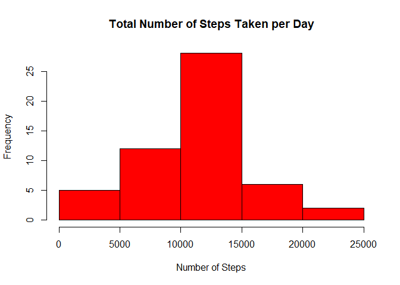
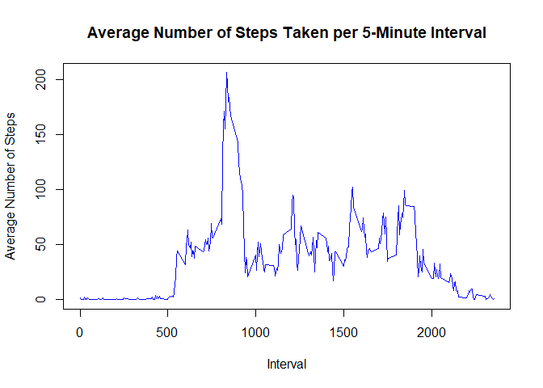
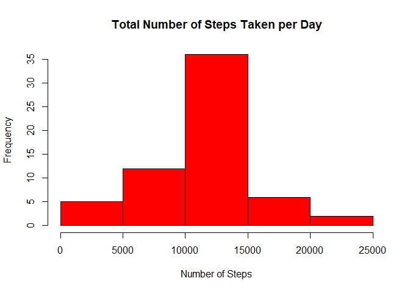
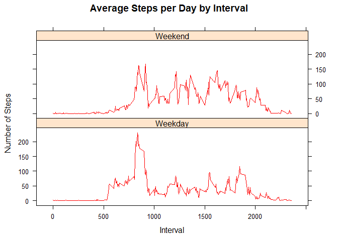

Introduction
------------
It is now possible to collect a large amount of data about personal movement using activity monitoring devices such as a Fitbit, Nike Fuelband, or Jawbone Up. These type of devices are part of the “quantified self” movement – a group of enthusiasts who take measurements about themselves regularly to improve their health, to find patterns in their behavior, or because they are tech geeks. But these data remain under-utilized both because the raw data are hard to obtain and there is a lack of statistical methods and software for processing and interpreting the data.

This assignment makes use of data from a personal activity monitoring device. This device collects data at 5 minute intervals through out the day. The data consists of two months of data from an anonymous individual collected during the months of October and November, 2012 and include the number of steps taken in 5 minute intervals each day.

The data for this assignment can be downloaded from the course web site:

- Dataset: [Activity Monitoring Dataset](https://d396qusza40orc.cloudfront.net/repdata%2Fdata%2Factivity.zip) [52K]

The variables included in this dataset are:

- steps: Number of steps taking in a 5-minute interval (missing values are coded as <span style="color: red;">**NA**</span>)
- date: The date on which the measurement was taken in YYYY-MM-DD format
- interval: Identifier for the 5-minute interval in which measurement was taken

The dataset is stored in a comma-separated-value (CSV) file and there are a total of 17,568 observations in this dataset.


## Loading and preprocessing the data

```r
library(data.table)

# set the working directory
setwd("C:/Users/stetz/Desktop/R_Scripts/RepData_PeerAssessment1")

URL <- "https://d396qusza40orc.cloudfront.net/repdata%2Fdata%2Factivity.zip"

# download and unzip the file if it doesn't already exist in the directory
if(!file.exists("activity.csv")){
  download.file(URL, destfile="repdata%2Fdata%2Factivity.zip")
  unzip("repdata%2Fdata%2Factivity.zip")
}

activityData <- fread(file="activity.csv")
```


## What is mean total number of steps taken per day?

```r
# Sum the total steps taken per day
dailySteps <- aggregate(steps ~ date, activityData, sum, na.action=na.omit)

# plot histogram
hist(dailySteps$steps, xlab="Number of Steps", main="Total Number of Steps Taken per Day", col="red")
```

<!-- -->

```r
# calculate the mean of the number of daily steps taken
mean(dailySteps$steps, na.rm=TRUE)
```

```
## [1] 10766.19
```

```r
# calculate the median of the number of daily steps taken
median(dailySteps$steps, na.rm=TRUE)
```

```
## [1] 10765
```


## What is the average daily activity pattern?

```r
# calculate steps per interval
stepsInterval <- aggregate(steps ~ interval, activityData, mean, na.action=na.omit)

# plot the intervals
plot(stepsInterval$interval, stepsInterval$steps, type="l", col="blue", xlab="Interval", 
     ylab="Average Number of Steps", main="Average Number of Steps Taken per 5-Minute Interval")
```

<!-- -->

```r
# Calculate the interval with the max amount of steps
stepsInterval[which.max(stepsInterval$steps),1]
```

```
## [1] 835
```


## Imputing missing values

```r
# calculate the number of missing values for each column
print(sapply(activityData, function(x) sum(is.na(x))))
```

```
##    steps     date interval 
##     2304        0        0
```

```r
# determine which indices are missing
indexNA <- which(is.na(as.character(activityData$steps)))

# copy the old dataset into a new one
fillData <- activityData

# convert to integer
stepsInterval$steps <- as.integer(stepsInterval$steps)

# fill in missing values with mean of correct 5-minute interval
fillData[indexNA,]$steps <- unlist(lapply(indexNA, FUN=function(indexNA){
            stepsInterval[activityData[indexNA,]$interval==stepsInterval$interval, ]$steps
  }))

# aggregate the steps data
dailySteps2 <- aggregate(steps ~ date, fillData, sum)

# plot histogram
hist(dailySteps2$steps, xlab="Number of Steps", main="Total Number of Steps Taken per Day", col="red")
```

<!-- -->


## Are there differences in activity patterns between weekdays and weekends?

```r
# change to date format
fillData$date <- as.Date(fillData$date)

# Determine the day of the week
fillData$day <- as.factor(weekdays(fillData$date))

# Determine the type of day
fillData$dayType <- as.factor(ifelse(fillData$day %in% c("Saturday", "Sunday"),"Weekend","Weekday"))

# calculate steps per interval
stepsInterval2 <- aggregate(steps ~ interval+dayType, fillData, mean, na.action=na.omit)

# plot the line graphs
library(lattice)
xyplot(stepsInterval2$steps ~ stepsInterval2$interval|stepsInterval2$dayType, xlab="Interval",
      ylab="Number of Steps", main="Average Steps per Day by Interval", layout=c(1,2), type="l", col="red")
```

<!-- -->


Activity is more evenly spread across the intervals on the weekends.
